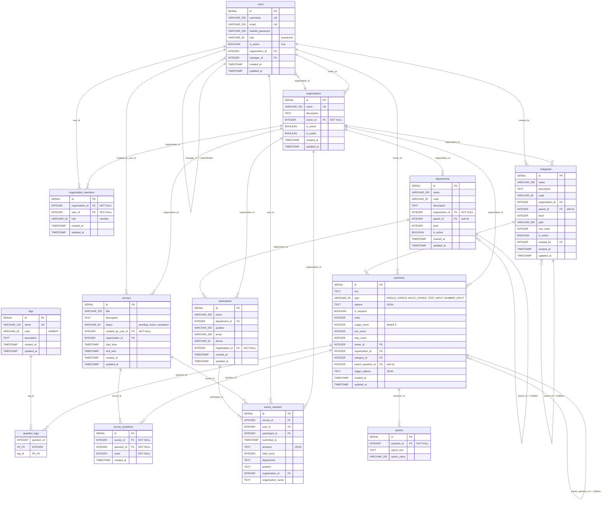

# Survey Product - Entity Relationship Diagram

## Relationships Summary

| Relationship | Type | Description |
|---|---|---|
| users <-> organizations | Many-to-Many | via `organization_members` junction table |
| users -> users | Self-ref | `manager_id` for hierarchical management |
| organizations -> users | One-to-Many | `owner_id` (organization owner) |
| organizations -> departments | One-to-Many | departments belong to an organization |
| departments -> departments | Self-ref | `parent_id` for hierarchical departments |
| organizations -> categories | One-to-Many | categories belong to an organization |
| categories -> categories | Self-ref | `parent_id` for hierarchical categories |
| categories -> questions | One-to-Many | questions categorized under a category |
| questions -> tags | Many-to-Many | via `question_tags` junction table |
| questions -> questions | Self-ref | `parent_question_id` for conditional logic |
| questions -> options | One-to-Many | individual answer options per question |
| surveys -> questions | Many-to-Many | via `survey_questions` junction table |
| surveys -> survey_answers | One-to-Many | submitted responses per survey |
| users -> survey_answers | One-to-Many | answers submitted by a user |
| participants -> survey_answers | One-to-Many | answers from a participant (QR scan) |
| departments -> participants | One-to-Many | participants belong to a department |
